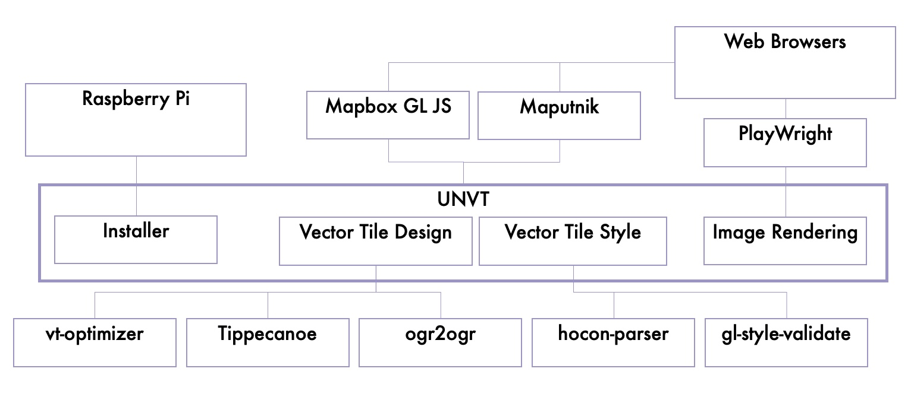

# Name
the United Nations Vector Tile Toolkit (UNVT)

# Purpose
- Enable everyone to produce, style, host, and optimize Vector Tiles (VT).
- Promote sharing of ideas and techniques on VT. 

# Background
Geospatial Information Authority of Japan (GSI) has been contributing
to [the UN Open GIS Initiative](http://unopengis.org/) by sharing
its Web Map expertise with 
[UN Geospatial](https://www.un.org/geospatial/) including
[UN Global Service Centre](https://www.ungsc.org/) since 2017.

# Overview
## 1. Produce
Convert Soure Data into
[GeoJSON Text Sequence (GeoJSONS)](https://tools.ietf.org/html/rfc8142)
with injecting Vector Tile Design Configuration. 

Feed the sequence into [Tippecanoe](https://github.com/mapbox/tippecanoe)
to produce [MBTiles](https://github.com/mapbox/mbtiles-spec) of 
[VT](https://github.com/mapbox/vector-tile-spec).

In the case of smaller Source Data, 
extract MBTiles into a filesystem with
[tile-join](https://github.com/mapbox/tippecanoe#tile-join).

In the case of larger Source Data, 
production will be done in a modular manner where
Source Data are split into modules of several gigabytes.

### Tile Designer's product
VT Design Configuration. The configuration is usually 
a JavaScript or Ruby script which takes a GeoJSONS from standard 
input, filters features with adding 
[GeoJSON extention for Tippecanoe](https://github.com/mapbox/tippecanoe#geojson-extension),
and stream them to standard output as GeoJSONS.

## 2. Style
Generate a `style.json` which conform to
[Style Specifications](https://docs.mapbox.com/mapbox-gl-js/style-spec/)
and in harmony with a VT Design Configuration.

[Human-Optimized Config Object Notation (HOCON)](https://github.com/lightbend/config#using-hocon-the-json-superset)
was introduced to organize the style configuration layer-wise
because in most cases a `style.json` is large and complex.

### Style Designer's product
VT Style Configuration. A set of HOCON files (\*.conf) in most cases.

## 3. Host
Host the product on the Web.

In the case of smaller Source Data, first we host the product locally using
[budo](https://github.com/mattdesl/budo), and then use 
[GitHub Pages](https://docs.github.com/ja/pages/getting-started-with-github-pages/about-github-pages)
to publish it.

## 4. Optimize
Analyze zoom-wize size distribution of VT using 
[vt-optimizer](https://github.com/ibesora/vt-optimizer).
Continuously improve VT Design Configurations. 

# Supporting Features
## equinox: UNVT installer for Raspberry Pi OS
UNVT so faithful to design principles of Unix and the Web
that UNVT capacity building was difficult on Windows. 

We usually use [Raspberry Pi](https://raspberrypi.org) for
UNVT capacity building. We have UNVT installer named 
[equinox](https://github.com/unvt/equinox) for Raspberry Pi OS.

We sometimes use [Docker](https://www.docker.com/), too.

## plow: Server-side image tile rendering PoC
[plow](https://github.com/hfu/plow) is a proof-of-concept (PoC)
of server-side on-demand image tile rendering using
[PlayWright](https://playwright.dev/).

GSI is also working on server-side on-demand image tile rendering.

# System Context Diagram

# Related Projects
## Adopt Geodata (optgeo) project
[Adopt Geodata (optgeo) project](https://github.com/optgeo)
is a project in tandem with UNVT.

The purpose of the project is to demonstrate the value
of VT, and to continuously improve UNVT, by 
creating VT from open geospatial data 
which are not yet in VT. 
