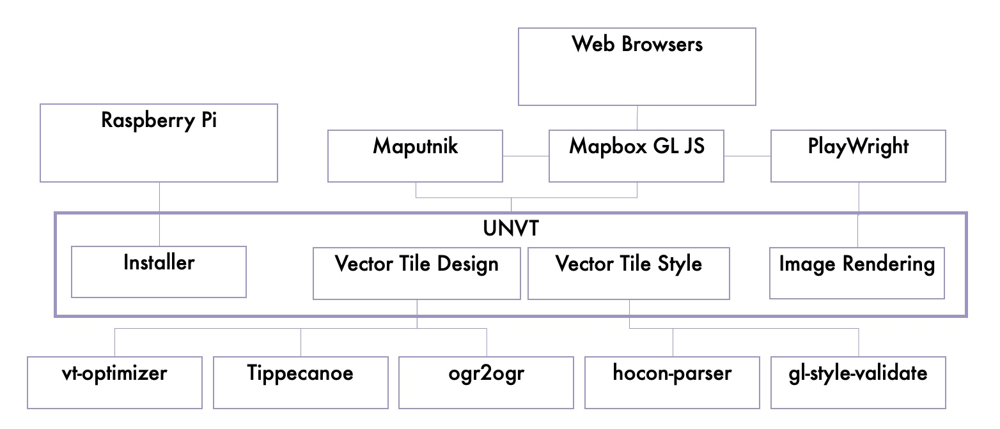

# Name
国連ベクトルタイルツールキット

# Purpose
あらゆるプレイヤーによる、ベクトルタイルの生産、スタイル、ホスト、最適化を支援すること。
また、そのための技術や工夫の共有を促進すること。

# Background
2017年以降、国土地理院のウェブ地図技術を国連地理空間情報課や
国連グローバルサービスセンターに共有し、
国連オープン GIS イニシアティブを通じ、
技術をともに発展させていくことになった。

# Overview
## 1. 生産
ソースデータを GeoJSON Text Sequence (GeoJSONS) に変換し、
ベクトルタイル設計情報を注入して Tippecanoe で
ベクトルタイルの mbtiles パッケージに変換する。

ソースデータが小規模なら、ベクトルタイルをファイルシステムに展開する。

ソースデータが大規模なら、数 GB 程度のモジュールに分割して生産する。

### 利用者プロジェクト
ベクトルタイル設計情報。通常、標準入力から与えられる GeoJSONS に
ベクトルタイル設計属性を追加するなどの加工をし、
GeoJSONS で標準出力する、Ruby や JavaScript で書かれた
スクリプト。

## 2. スタイル
ベクトルタイル設計情報に合わせて、Mapbox Style に準拠した
style.jsonを生成する。

通常、style.json は大規模で複雑になることから、
HOCON を用いてレイヤごとにファイルを分割して整理する。。

### 利用者プロダクト
ベクトルタイルスタイル情報。

通常、HOCON ファイル（*.conf）のセット。

## 3. ホスト
ベクトルタイルやスタイルファイルなどのプロダクトをウェブにホストする。

ソースデータが小規模なら、通常、budo でローカルにホストし、
公開する際には GitHub Pages を用いる。

## 4. 最適化
vt-optimizer を使って、ズームレベルごとの
ベクトルタイルのサイズ分布を分析し、
ベクトルタイル設計情報を継続的に改善する。

# System Context Diagram

# Supporting Features
## [equinox: UNVT installer for Raspberry Pi OS](https://github.com/unvt/equinox)

## [plow: Server-side image tile rendering PoC](https://github.com/hfu/plow)

# Related Projects
## [Adopt Geodata (optgeo) project](https://github.com/optgeo)
